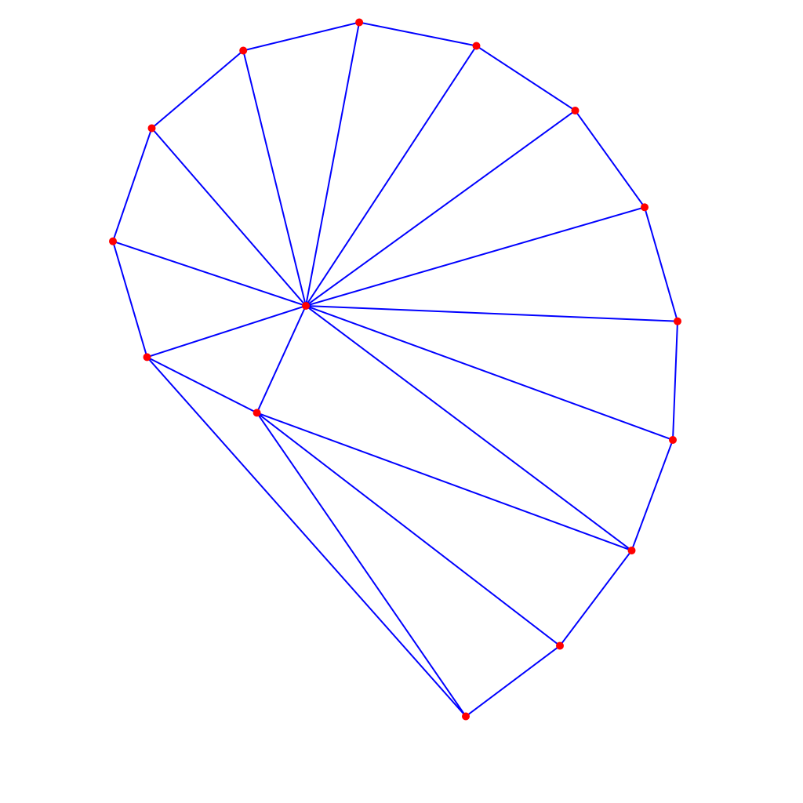
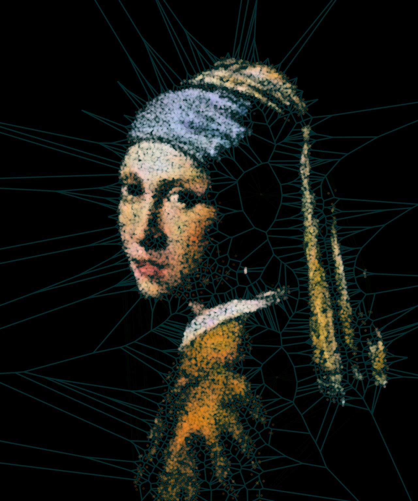
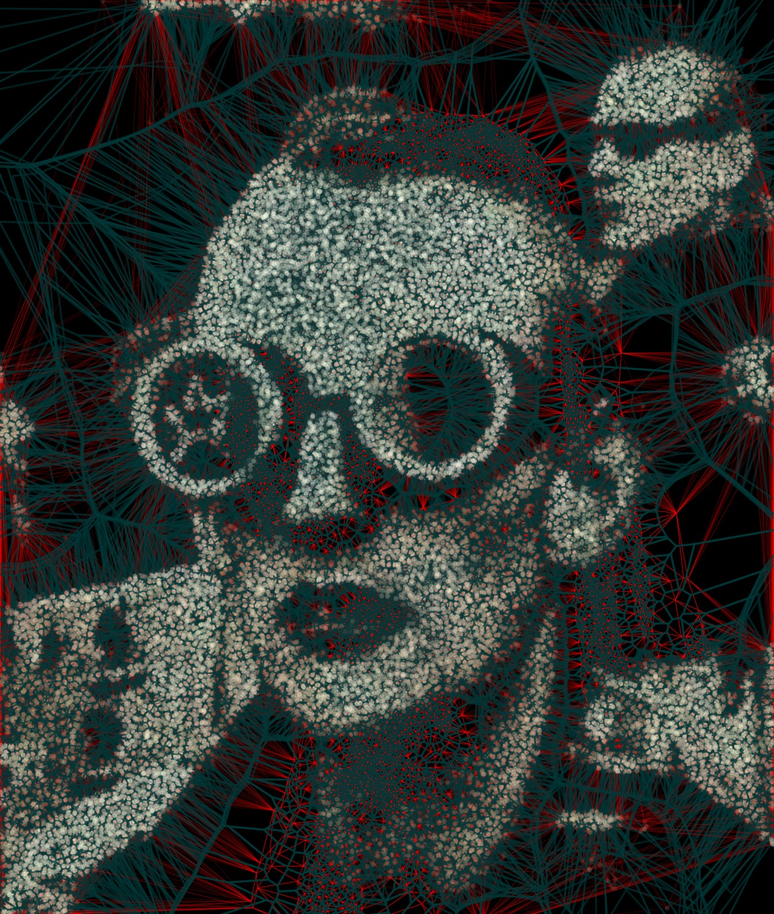

[](https://github.com/Siskin-framework/Rebol-Triangulate/actions/workflows/main.yml)
[](https://app.gitter.im/#/room/#Rebol3:gitter.im)

# Rebol/Triangulate

[Triangle](https://www.cs.cmu.edu/~quake/triangle.html) (A Two-Dimensional Quality Mesh Generator and Delaunay Triangulator) extension for [Rebol3](https://github.com/Siskin-framework/Rebol)

# Basic usage example

```rebol
import 'triangulate

;- the `inp` object must have at least `points` as a vector with decimal values
inp: object [
   points: #(f64! [
       0.0   0.0
       10.0  0.0
       10.0  10.0
       0.0   10.0
       2.5   2.5
   ])
   report: true ;; will print triangulation info
]

out: object [
	points:          none
	attributes:      none
	markers:         none
	segments:        none
	segment-markers: none
	edges:           none
	triangles:       none

	; voronoi output:
	v-points:        none
	v-attributes:    none
	v-edges:         none
	v-norms:         none  
]

triangulate inp out ;; the triangulation request

;- the `out` object should now contain the result of the triangulation

? out
```
Should output:
```
Initial triangulation:

Point    0:  0  0   marker 1
Point    1:  10  0   marker 1
Point    2:  10  10   marker 1
Point    3:  0  10   marker 1
Point    4:  2.5  2.5   marker 0

Segment    0 points:     1     0   marker 1
Segment    1 points:     2     1   marker 1
Segment    2 points:     3     2   marker 1
Segment    3 points:     0     3   marker 1

Edge    0 points:     3     0   marker 1
Edge    1 points:     0     4   marker 0
Edge    2 points:     4     3   marker 0
Edge    3 points:     4     1   marker 0
Edge    4 points:     1     2   marker 1
Edge    5 points:     2     4   marker 0
Edge    6 points:     0     1   marker 1
Edge    7 points:     2     3   marker 1

Initial Voronoi diagram:

Point    0:  -2.5  5
Point    1:  7.5  5
Point    2:  5  -2.5
Point    3:  5  7.5

Edge    0 points:     0    -1  -10  0
Edge    1 points:     0     2
Edge    2 points:     0     3
Edge    3 points:     1     2
Edge    4 points:     1    -1  10  0
Edge    5 points:     1     3
Edge    6 points:     2    -1  0  -10
Edge    7 points:     3    -1  0  10

OUT is an object of value:
  points          vector!    #(vector! decimal! 64 10 [0.0 0.0 10.0 0.0 10.0 10.0 0.0 10.0 2.5 2.5])
  attributes      none!      none
  markers         vector!    #(vector! integer! 32 5 [1 1 1 1 0])
  segments        vector!    #(vector! integer! 32 8 [1 0 2 1 3 2 0 3])
  segment-markers vector!    #(vector! integer! 32 4 [1 1 1 1])
  edges           vector!    #(vector! integer! 32 16 [3 0 0 4 4 3 4 1 1 2 2 4 0 1 2 3])
  triangles       vector!    #(vector! integer! 32 12 [3 0 0 4 4 3 4 1 1 2 2 4])
  v-points        vector!    #(vector! decimal! 64 8 [-2.5 5.0 7.5 5.0 5.0 -2.5 5.0 7.5])
  v-attributes    none!      none
  v-edges         vector!    #(vector! integer! 32 16 [0 -1 0 2 0 3 1 2 1 -1 1 3 2 -1 3 -1])
  v-norms         vector!    #(vector! decimal! 64 16 [-10.0 0.0 0.0 0.0 0.0 0.0 0.0 0.0 0.0 0.0 0.0 0.0 0.0 0.0 0.0 0.0])
```

# Delaunay triangulation of a set of vertices
```rebol
import 'triangulate
import 'blend2d

inp: object [
   ; spiral shaped input points
   points: #(f64! [
      390.0 390.0
      327.6 526.4
      187.5 455.4
      144.0 307.7
      193.5 163.5
      310.2  64.5
      458.1  28.5
      607.5  58.5
      733.5 141.0
      822.0 264.3
      864.0 409.7
      858.0 561.0
      805.5 702.0
      714.0 823.5
      594.0 913.5
   ])
   report: true
]

out: object [
	edges: none ; we are interested only in the edges
]

triangulate inp out

img: draw 1024x1024 [

   ; draw edges...
   line-width 2
   pen blue   line  :inp/points :out/edges

   ; draw input points
   line-width 0
   point-size 10
   fill red   point :inp/points
]

save %out/spiral.png img
```
Results to:


# Real life example

More advanced example is [triangulate-image.r3](test/triangulate-image.r3), which is using the triangulation
to draw line effects like:


or:

